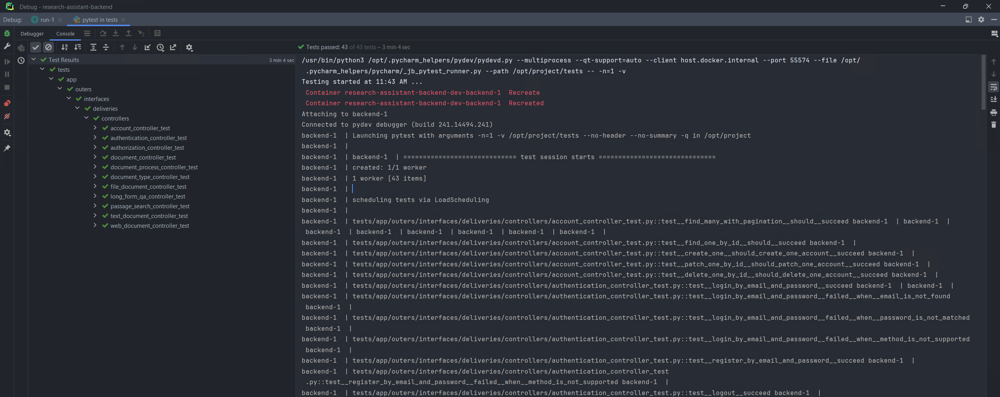

# research-assistant-backend

## Features

- [x] Authentication
- [x] Authorization
- [x] Account Management
- [x] Document Management
- [x] File Document Management
- [x] Text Document Management
- [x] Web Document Management
- [x] Document Process Management
- [x] Document Type Management
- [x] Long Form Question Answering
- [x] Passage Search

## Getting Started
1. Clone infrastructure, backend and frontend repositories.
2. Setup infrastructure, backend and frontend dependencies.
3. Run the infrastructure, backend and frontend services.

## Testing
1. Run the tests.
```bash
python3 -m pytest ./tests -n auto 
```
2. Current test result (mostly happy case).

